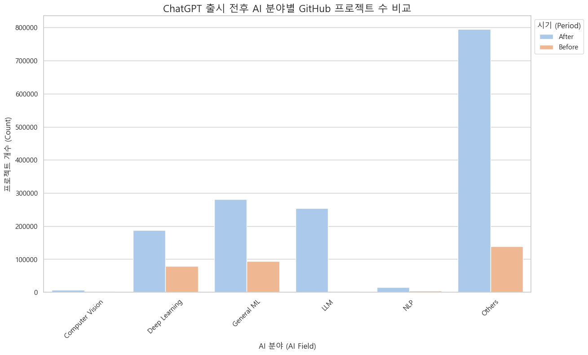
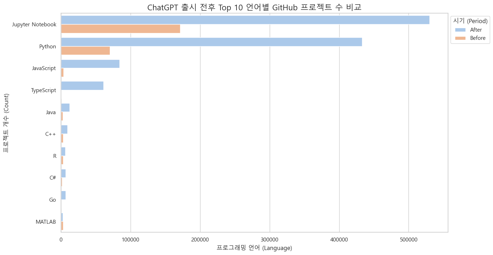
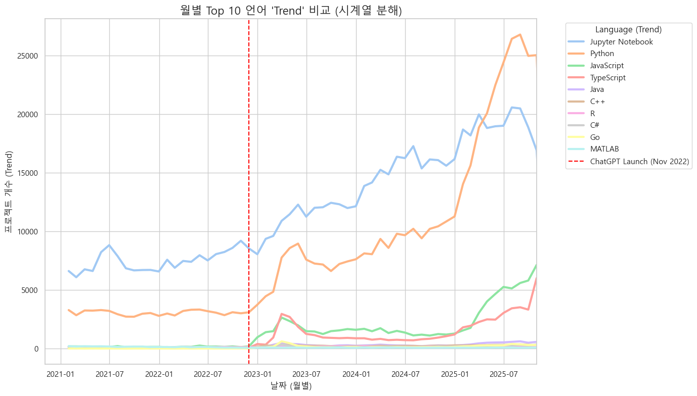
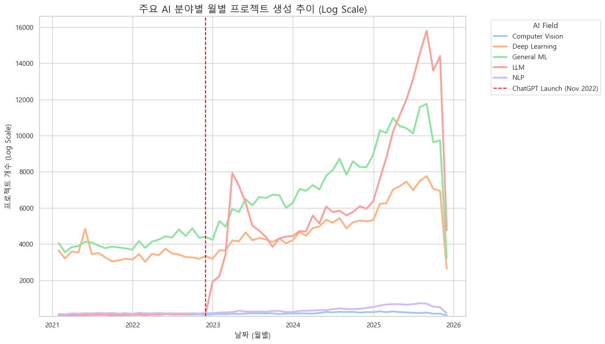
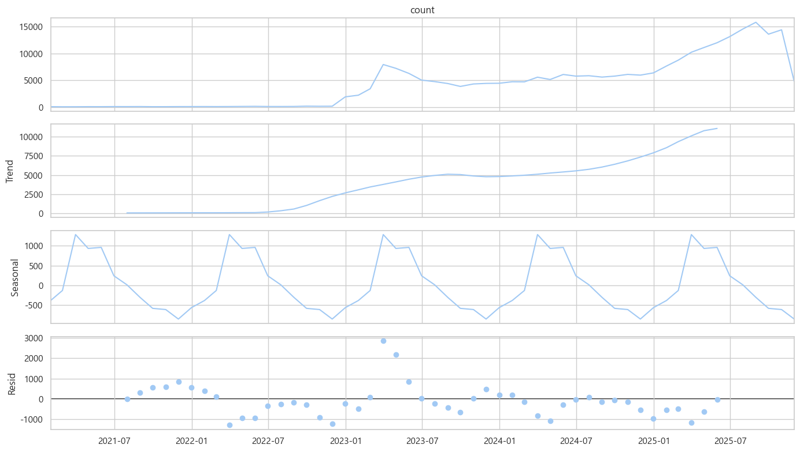
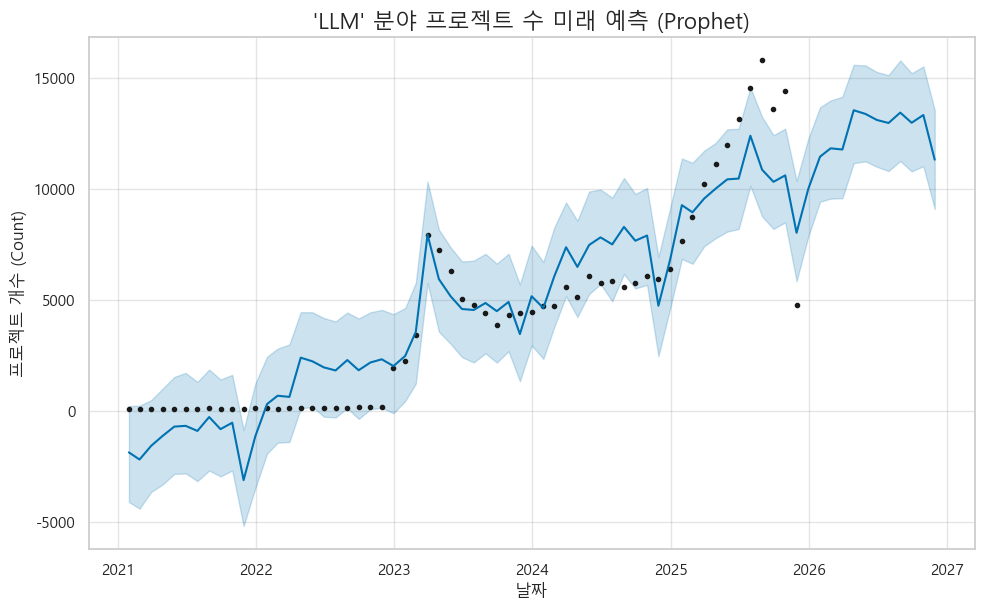
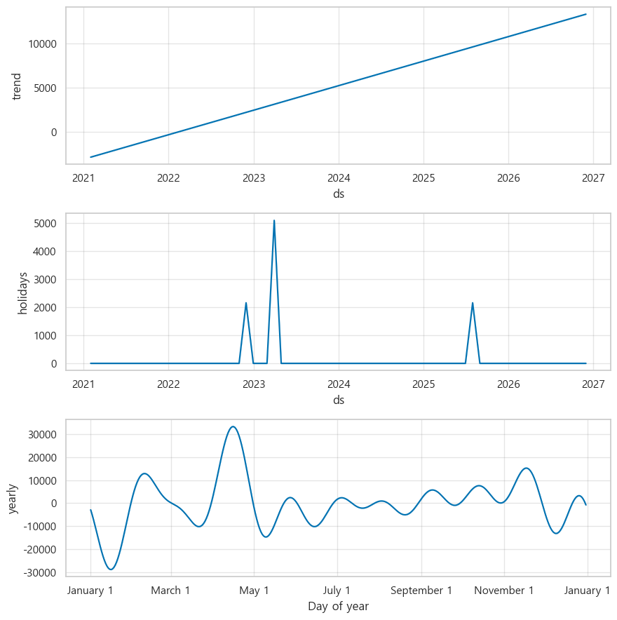
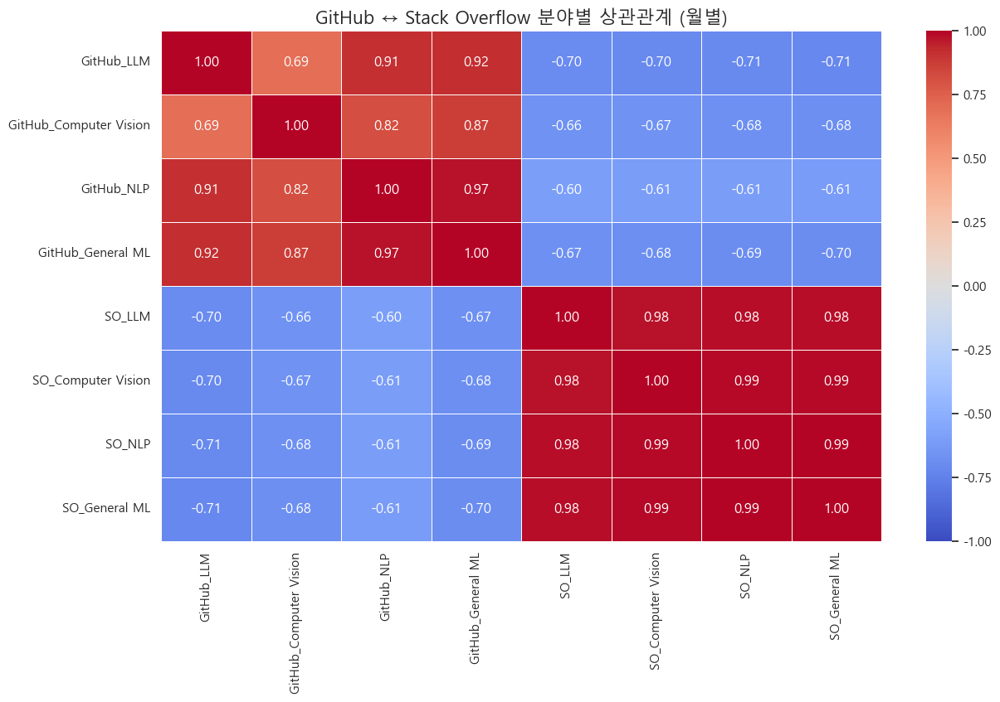
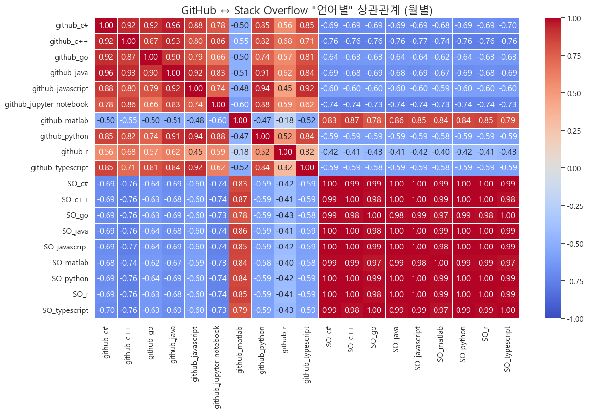

# ChatGPT와 Vibe Coding 이후, 개발자 생태계는 어떻게 변했는가?

> 한양대학교 ERICA 스마트융합공학부 스마트ICT융합전공
> GitHub 및 Stack Overflow 데이터 기반 AI 개발 생태계 변화 분석

## 프로젝트 소개

본 연구는 2022년 11월 ChatGPT 출시 이후 소프트웨어 개발 시장에 미친 영향을 GitHub와 Stack Overflow 데이터를 통해 정량적으로 분석합니다. AI 코드 생성 도구가 개발 시장의 프로젝트 생성량, 언어별 사용 추세, AI 분야별 성장 패턴에 어떤 변화를 가져왔는지 시계열 분석과 Prophet 예측 모델을 활용하여 탐구합니다.

### 주요 성과

- **LLM 분야 급부상**: ChatGPT 이후 25만 건 이상으로 폭증, 새로운 주류 카테고리 형성
- **개발 패러다임 전환**: 2023년 중반 Python이 Jupyter Notebook 추월 (연구→애플리케이션 개발)
- **Stack Overflow 역상관**: GitHub 프로젝트 증가 시 Stack Overflow 질문 감소 (-0.70 상관계수)
- **Prophet 예측 모델**: 장기 추세와 계절성 분리, ChatGPT/Auto-GPT 이벤트 효과 정량화

## 프로젝트 웹페이지

프로젝트 소개 및 연구 결과 시각화는 GitHub Pages를 통해 확인하실 수 있습니다:

**🔗 [https://teamcountingstars.github.io/dataAnalysis/](https://teamcountingstars.github.io/dataAnalysis/)**

## 관련 저장소

- **메인 프로젝트**: [https://github.com/TeamCountingStars/dataAnalysis](https://github.com/TeamCountingStars/dataAnalysis)

## 기술 스택

### 데이터 수집 및 전처리
- **데이터 소스**: GitHub API, Stack Overflow Data Dump
- **라이브러리**: Pandas, NumPy
- **기간**: 2021-2025 (ChatGPT 출시 전후 비교)

### 시계열 분석 및 예측
- **예측 모델**: Facebook Prophet
- **시각화**: Matplotlib, Seaborn
- **분석 기법**: 시계열 분해, 상관관계 분석, Log Scale 트렌드 분석

### 데이터셋
- **GitHub 데이터**: AI 관련 레포지토리 생성량, 언어별 분포
- **Stack Overflow 데이터**: AI 관련 질문 수, 태그별 분포
- **분류 카테고리**: LLM, Deep Learning, Computer Vision, NLP, Reinforcement Learning 등

## 팀 구성

| 이름 | 역할 |
|------|------|
| **윤태웅** | 데이터 분석 및 시계열 모델링 |
| **원준서** | 데이터 수집 및 전처리 |
| **송민찬** | 시각화 및 통계 분석 |
| **이라온** | 상관관계 분석 및 검증 |

## 연구 질문

**RQ1**: ChatGPT 출시 전후(2021-2022 vs 2023-2025) GitHub AI 프로젝트는 어떻게 변화했는가? 
**RQ2**: Github 레포지토리가 2023년 이후 실제로 증가했는가? 
**RQ3**: AI 분야별(LLM, 강화학습, 컴퓨터비전, NLP) 프로젝트 증가 양상이 다른가? 
**RQ4**: Stack Overflow 질문 수와 GitHub 프로젝트 수 간 상관관계가 있는가? 

---

## RQ1. ChatGPT 출시 전후 GitHub AI 프로젝트 생성량 분석

### 1. AI 분야별 프로젝트 수 비교

- 모든 AI 분야에서 2023년 이후 압도적 증가
- LLM 분야가 25만 건 이상으로 급부상하며 새로운 주류 카테고리 형성
- Others 항목이 15만 건에서 80만 건으로 폭증 (새로운 AI 응용 분야 확대)

---

### 2. 언어별 사용 현황 분석

- Python과 Jupyter Notebook이 압도적 1, 2위
- JavaScript, TypeScript의 급격한 증가 (AI의 웹 애플리케이션화)
- 전통적 정적 언어들도 성장세 유지

---

## RQ2. 레포지토리 2023년 이후 실제 증가 양상 분석

- **2023년 중반**: Python이 Jupyter Notebook을 추월
- AI 개발이 '연구/분석'에서 '실제 애플리케이션 개발'로 패러다임 전환

---

## RQ3. AI 분야별 프로젝트 증가 양상 분석

### 1. 분야별 성장 추이 (Log Scale)

- LLM 분야가 2023년 초를 기점으로 수직 상승
- 기존 강자(Deep Learning, General ML)를 압도하는 성장률

---

### 2. LLM 분야 시계열 분해 분석

- **Trend (추세)**: 2023년 초를 기점으로 강력한 우상향 추세 시작
- **Seasonal (계절성)**: 상반기 정점, 하반기 저점의 연간 주기 패턴
- **Resid (잔차)**: 2023년 초와 2025년 여름의 예측 불가능한 충격 (ChatGPT, Auto-GPT 출시)

---

### 3. Prophet 예측 모델

> Prophet 라이브러리의 holidays 파라미터를 사용하여 '이벤트'를 '계절성'으로 착각하는 문제 해결

- 장기 추세와 계절성을 바탕으로 안정적인 미래 예측
- ChatGPT, Auto-GPT 이벤트를 별개의 특별 이벤트로 분리하여 학습

---

### 4. Prophet 모델 분해 분석

- **Trend**: 매끄럽고 강력한 우상향 성장률
- **Holidays**: 2023년 초와 2025년 여름의 스파이크를 별개의 이벤트로 분리
- **Yearly**: 이벤트 제거 후 순수한 12개월 주기 패턴 (상반기 높음, 하반기 낮음)

---

## RQ4. Stack Overflow 질문 수와 GitHub 프로젝트 수 간 상관관계 분석

### 1. 분야별 상관관계 분석

- GitHub 내 모든 AI 분야 간 강한 양의 상관관계
- Stack Overflow 내 모든 AI 질문 간 강한 양의 상관관계
- **GitHub ↔ Stack Overflow 간 강한 음의 상관관계** (GitHub_LLM ↔ SO_LLM = -0.70)
- GitHub 프로젝트 증가 시 Stack Overflow 질문은 감소

---

### 2. 언어별 상관관계 분석

- **Trend (추세)**: 2023년계 분석

- Python(-0.59), C++(-0.76), JavaScript(-0.59), C#(-0.69) 등 모든 주요 언어에서 강한 음의 상관관계
- **예외**: MATLAB만 +0.83으로 강한 양의 상관관계 (ChatGPT 영향 미미)

---

## 문의

프로젝트에 대한 문의사항은 아래 이메일로 연락주세요:

**윤태웅** - taewoong25@hanyang.ac.kr
