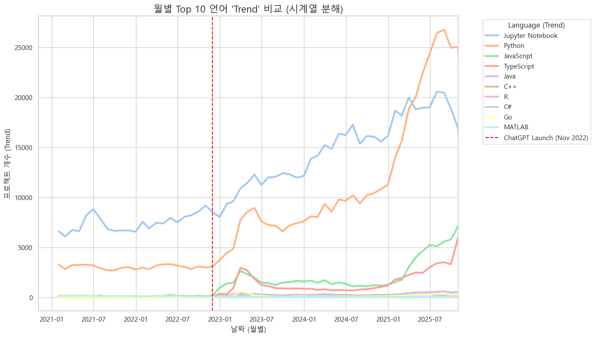
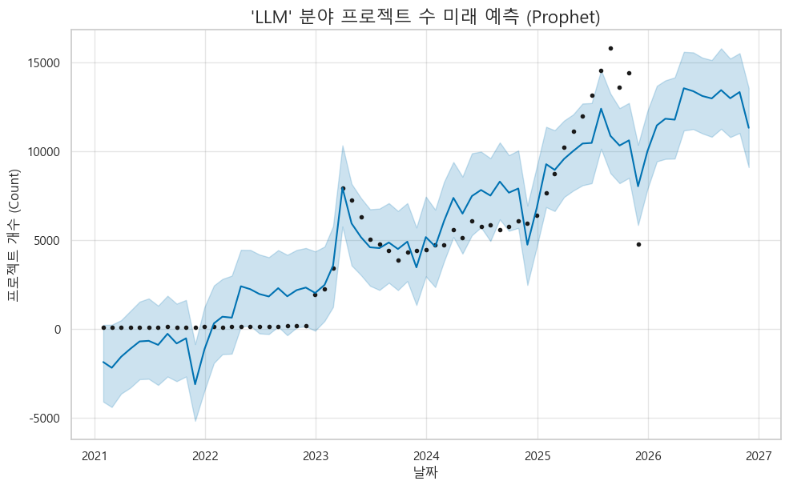
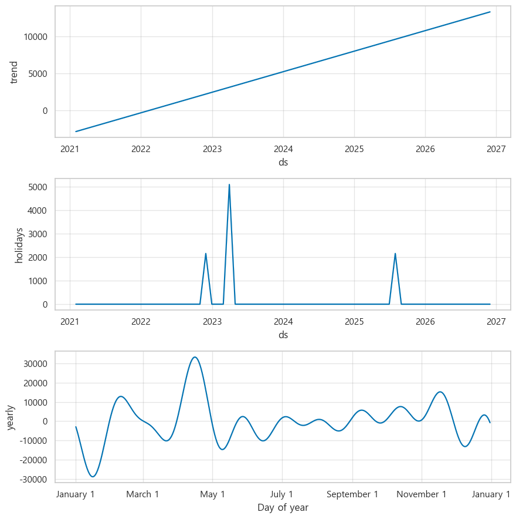

### ChatGPT 출시 전후 GitHub AI 프로젝트 생성량 분석

  
  

 
모든 AI 분야에서 After(2023-2025)의 프로젝트 수가 Before(2021-2022)에 비해 압도적으로 증가했습니다. LLM repo의 급증과 함께 다양한 ai의 비중도 급증했습니다. 이 분석 결과로 저희팀은 챗지피티 출시 이후 3년간 ai관련 프로젝트가 얼마나 증가했는지 시각적으로 체감할 수 있었습니다.
 
 Jupyter Notebook과 Python이 압도적인 1, 2위를 차지했습니다. 예상했던 결과지만 다른 언어랑 비교했을때 압도적인 증가량을 보였습니다. 또한 저희가 주목한점은 Before 시기에는 미미했던 JavaScript와 TypeScript가 After 시기에 급격히 늘어났습니다. 저희 팀 생각으로는 단순 사람들이 ai개발에만 집중한게 아닌 ai의 인터페이스나, 웹페이지에서 사용된 단순 챗봇을 JS와 TS를 사용해서 개발한것이 아닌가 추측해봤습니다. 마지막으로 Java, C++, Go 등도 전반적으로 상승했으나 Python 생태계의 성장세에는 미치지 못했습니다. 아마 개발자의 수요가 늘어나며 대부분의 언어 사용률이 증가한것으로 보입니다.

---

### 레포지토리 2023년 이후 실제 증가 양상 분석

 
가설과 같이 당연하게도 Python과 Jupyter Notebook은 ChatGPT 출시 직후 급증하는걸 볼 수 있었습니다.
 
그중에서도 저희팀이 집중한건 ChatGPT 출시 직후 약 반년동안 훅 올라간 그래프의 변화입니다. Python, Jupyter Notebook, JS, TS 네개의 대표 언어는 ChatGPT 출시 직후에 아주 급격하게 증가하는 모습을 보입니다.
 
그리고 또 하나 주목해야 하는 부분은 2025년 1월 이후인데2025년 2월 3일에 바이브코딩이란 단어가 생겼는데 그 이후로 파이썬이 다른 언어들에 비해 급격하게 증가하는 모습이 보입니다. 저희팀은 이걸 보고 바이브코딩이 생기며 많은 비전공 개발자들이 Python으로 많은 프로젝트를 생성했구나 라는걸 알 수 있었으며, 깃허브를 사용하지 않는 개발자까지 합친다면 Python은 2025년 이후 엄청난 사용률을 보였음을 알 수 있었습니다.

### AI 분야별 프로젝트 증가 양상 분석

  
  
  
  

 
첫번째 그래프는 너무나도 당연하게 가설을 증명해주었다.
다른 AI분야도 급격한 성장을 보여주지만 LLM은 챗지피티 출시 이전과 비교하면 확연한 차이를 보여줬다.
 
두번째 이미지는 이제 시계열 분해를 해봤는데, 우린 3,4번째 그래프에 주목했다. 매년 반복되는 패턴, 상반기에 올라가고 하반기에 내려가는 규칙성은 우리팀의 추측으론 IT기업이 여름에 활발히 활동하고 겨울엔 겨울휴가나 1년의 프로젝트를 마무리하며 저런 결과가 나온게 아닐까 싶다. 마지막 그래프는 2023년에 위로 크게 튄 점들이 있는데 챗지피티 출시 직후 약간 튀었던 점이 23년 초반에 다시 튀는걸 보니 저때 본격적으로 개발분야에서 지피티를 사용한 사람이 늘어난게 아닐까 추측해본다.
 
세번째 그래프는 Prophet 예측인데 2023년 급등 이후 안정적인 성장을 예측 가능했으며 2027년까지 예측을 해봤을 때 계속 증가할 것이라고 예측이 가능했다.
 
마지막 그래프는 Prophet 모델이 데이터를 어떻게 분해해서 이해했는지 보여주는 그래프인데 우상향하는 기본 성장률을 완벽하게 잡아냈고, Prophet는 2023년 초와 2025년 여름의 스파이크를 이벤트로 분리해냄을 보여준다. 마지막 그래프는 이벤트가 제거된 후의 순수한 주기이며 규칙적인 패턴이 있음을 보여준다. 이 그래프는 우리가 사용한 Prophet모델이 이벤트라는 외부 충격을 노이즈가 아닌 별개의 정보로 현명하게 분리해냄을 알 수 있었다.

### Stack Overflow 질문 수와 GitHub 프로젝트 수 간 상관관계 분석

  
  

 
첫번째 그래프에서는 깃허브와 스택오버플로우 내의 모든 AI 분야는 강한 양의 상관관계를 보이고 있으나 깃허브와 스택오버플로우는 서로 강한 음의 상관관계를 보이고 있었다. 우리팀은 처음 프로젝트를 시작하며 이 주제를 메인으로 삼았고 당연히 ai분야가 확 뜨며 관련 깃허브 레포도 늘어나고 스택오버플로우에서 그에 관한 대화도 늘었을거라고 예상했다. 그러나 결과는 반대였다. 관련 깃허브 레포는 당연히 늘어났으나 스택오버플로우에서의 대화는 줄어들었다. 우리팀은 이제 챗지피티 클로드 등 LLM의 발전으로 개발자간의 소통이 줄어들고 ai의 의존도가 올라갔다. 라는 결론을 내리게 되었다.
 
두번째 그래프는 언어별 상관관계를 확인해봤는데 대부분의 언어들이 모두 강한 음의 상관관계를 보여줬다. 그러나 MATLAB은 달랐다. GitHub Matlab (0.83~0.87)과 SO 언어들 간 강한 양의 상관관계를 보여줬고 우리팀은 매트랩은 AI가 많이 학습하지 못한 언어라서 오히려 AI의존도보단 스택오버플로우에서 개발자들이 오히려 활발하게 공유하고 있다 라고 추측할 수 있었다.