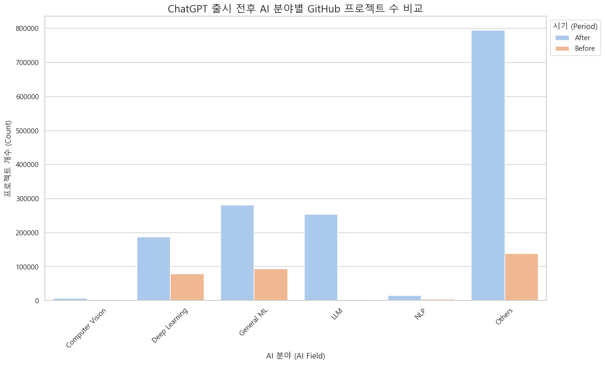
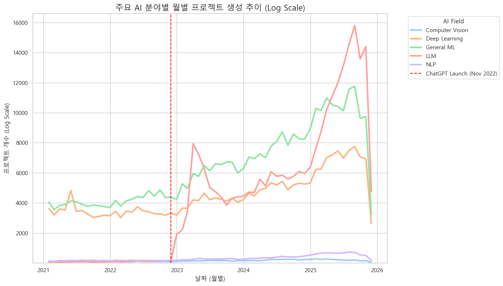
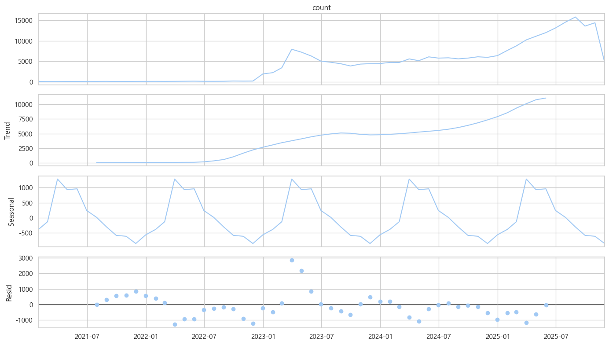
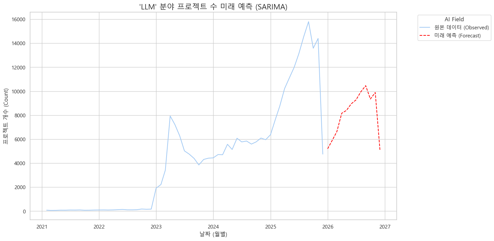
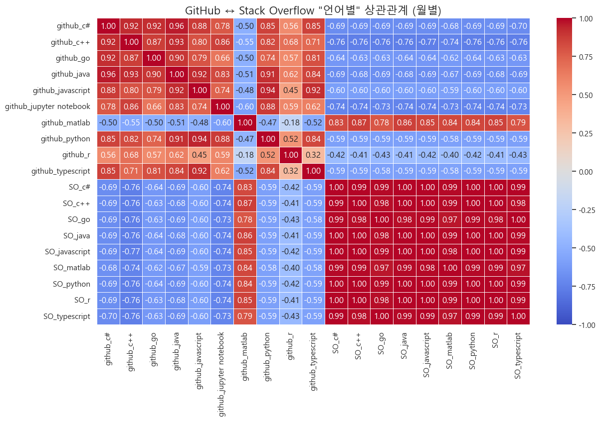

# Q1. ChatGPT 출시 전후(2021-2022 vs 2023-2025) GitHub AI 프로젝트 생성량 분석

---
# Q2. 레포지토리가 ChatGPT 출시 2023년 이후 실제 증가 양상 분석
## 1. Top 10 언어 'Trend'비교

## 2. 키워드 생성 추이

## 3. Top 10 언어별 키워드 생성 추이

---
# Q3. AI 분야별 프로젝트 증가 양상 분석
## 1. AI 분야별 프로젝트 생성 추이

---
# Q3-1. 분석 결과에 대한 미래 예측
## 1. SARIMA 예측 모델

결과 : 실패

---
## 2. Prophet 예측 모델

결과 : 평균적으로 ± 2,217.07 개의 프로젝트 수를 차이 나게 예측

---
# Q4. Stack Overflow 질문 수와 GitHub 프로젝트 수 간 상관관계 분석
## 1. 분야별 상관관계 분석

## 2. 언어별 상관관계 분석

| Language | Model (Y = mX + b) | R-squared |
| --- | --- | --- |
| Python | Y = -0.38 * X + 11527.15 | 0.352442 |
| JavaScript | Y = -0.13 * X + 2229.14	 | 0.360368 |
| TypeScript | Y = -0.51 * X + 1608.32 | 0.343246 |
| Java | 	Y = -0.03 * X + 325.48 | 0.467990 |
| C++ | Y = -0.03 * X + 250.41 | 0.579037 |
| R	 | Y = -0.01 * X + 166.78 | 0.170623 |
| C# | Y = -0.02 * X + 187.60 | 0.482109 |
| Go | Y = -0.24 * X + 184.14 | 0.400200 |
| MATLAB | Y = 0.30 * X + 82.00 | 0.704192 |
